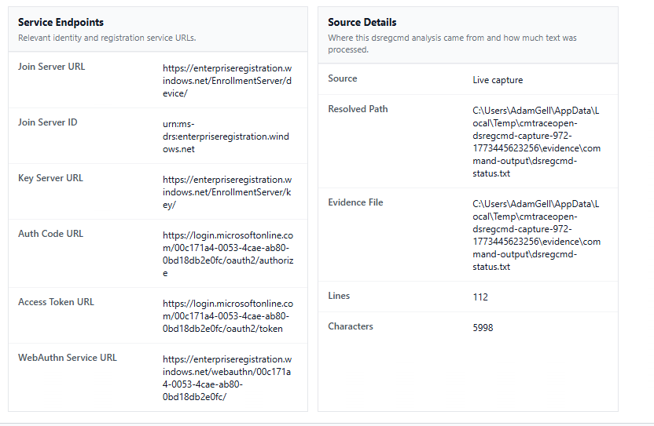
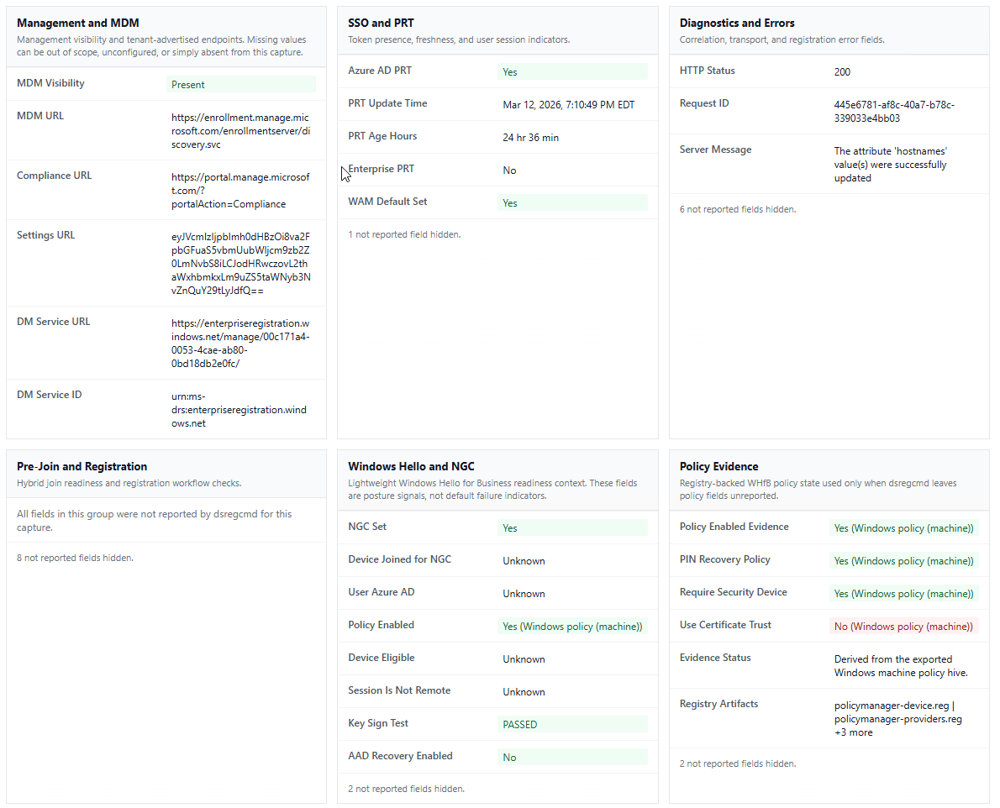
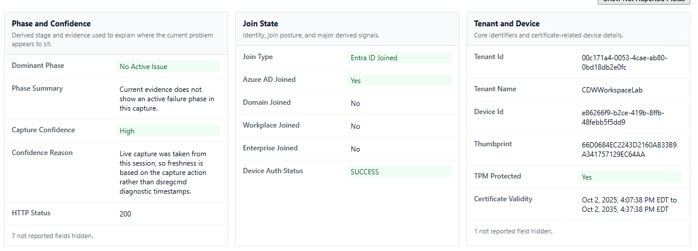

# DSRegCmd Troubleshooting

This guide explains how to use the DSRegCmd workspace in CMTrace Open to
triage Microsoft Entra join, hybrid join, PRT, MDM visibility, and Windows
Hello for Business issues without manually reading raw `dsregcmd /status`
output line by line.


## What This Workspace Is For

The DSRegCmd workspace is designed to answer four questions quickly:

1. What join posture does this device actually have?
2. Which stage is failing right now: discovery, auth, join, or post-join?
3. How trustworthy is this capture?
4. Do registry-backed Windows Hello for Business policy signals explain what
   `dsregcmd` did not report directly?

The workspace does not replace raw output. It reorganizes it into a triage view
so you can move from symptom to likely cause faster.

## Supported Input Methods

You can analyze DSRegCmd data in four ways:

1. `Capture`
2. `Paste`
3. `Open Text File`
4. `Open Evidence Folder`

### Capture

`Capture` runs a live `dsregcmd /status` collection and stages a temporary
bundle that includes both command output and sibling registry evidence.

This is the preferred option when you are troubleshooting the local device and
want the highest-confidence result.

### Paste

`Paste` is useful when someone already copied `dsregcmd /status` output from a
remote machine or ticket.

Use this when you only have text and no supporting evidence bundle.

### Open Text File

`Open Text File` loads a plain text `dsregcmd /status` capture.

If that file lives inside a supported evidence bundle, the workspace will also
try to discover the bundle root and load sibling registry evidence.

### Open Evidence Folder

`Open Evidence Folder` accepts any of these folder shapes:

1. Bundle root
2. Bundle `evidence` folder
3. Bundle `command-output` folder

The expected command output file is:

```text
evidence/command-output/dsregcmd-status.txt
```

Top-level `dsregcmd-status.txt` is also supported when it exists inside a valid
bundle root.

Standalone folders that only contain a loose `dsregcmd-status.txt` file are not
treated as evidence bundles.

## Evidence Bundle Layout

Live capture and bundle-based analysis work best when the evidence looks like
this:

```text
bundle-root/
  manifest.json
  evidence/
    command-output/
      dsregcmd-status.txt
    registry/
      policymanager-device.reg
      policymanager-providers.reg
      hkcu-policies.reg
      hklm-policies.reg
      hkcu-microsoft-policies.reg
      hklm-microsoft-policies.reg
```

Those registry exports let the analyzer correlate Windows Hello for Business
policy even when `dsregcmd` leaves policy-backed fields unreported.

## How To Read The Workspace

### 1. Start With The Header Cards

The top cards are the fastest read of the capture:

1. `Join Type`
2. `Current Stage`
3. `Capture Confidence`
4. `PRT State`
5. `MDM Signals`
6. `NGC`
7. `Certificate`

The first two cards tell you what the device looks like and where the current
problem appears to sit.

`Capture Confidence` matters more than most people expect. A stale bundle or a
SYSTEM remote-session capture can make user-scoped token state look worse or
different than the real interactive user session.



### 2. Read The Health Summary Before The Raw Facts

The `Health Summary` section gives you a short narrative of the current result,
including:

1. source type
2. derived join posture
3. dominant failure stage
4. confidence note
5. highest-priority issue

The `Issue spotlight` is the fastest way to explain the likely root cause to
someone else without handing them the raw command output.

### 3. Use Issues Overview For Root-Cause Triage

`Issues Overview` contains the ordered diagnostic findings produced by the Rust
analyzer.

Each issue card includes:

1. severity
2. category
3. summary
4. evidence lines
5. recommended checks
6. suggested fixes

This is where federation, SCP, DRS discovery, PRT, TPM, and Windows Hello
signals are turned into actionable troubleshooting guidance.

### 4. Use Facts By Group To Verify The Diagnosis

The grouped facts are the proof layer behind the issue cards. The main groups
to pay attention to are:

1. `Phase and Confidence`
2. `Join State`
3. `Management and MDM`
4. `SSO and PRT`
5. `Diagnostics and Errors`
6. `Pre-Join and Registration`
7. `Windows Hello and NGC`
8. `Policy Evidence`
9. `Source Details`

Use `Show Not Reported Fields` when you need to see exactly what the source did
not provide.

This is especially useful when comparing a live capture against a pasted or
historical bundle.



### 5. Treat Policy Evidence As Supporting Context, Not Magic

The `Policy Evidence` group exists to fill in gaps when `dsregcmd` does not
surface Windows Hello for Business policy clearly.

It can derive evidence from:

1. PolicyManager current device state
2. PolicyManager provider state
3. Windows machine policy hive
4. Windows user policy hive

That includes PassportForWork values under Microsoft policy hives such as:

```text
HKLM\SOFTWARE\Microsoft\Policies\PassportForWork
HKCU\SOFTWARE\Microsoft\Policies\PassportForWork
```

If policy values are still `Not Reported`, that does not automatically mean the
feature is broken. It can also mean the captured registry artifacts simply do
not contain mapped PassportForWork values.

### 6. Use Timeline And Flows For Sanity Checking

The `Timeline` and `Flows` sections help you verify whether the rest of the
analysis makes sense in time and context.

The timeline surfaces key timestamps such as:

1. certificate validity
2. previous PRT attempt
3. Azure AD PRT update time
4. client reference time

The flow boxes compress the state into practical readouts for:

1. current phase
2. join posture
3. device authentication
4. management
5. PRT and session
6. NGC readiness
7. capture trust

If the flow boxes and grouped facts disagree, trust the grouped facts and raw
evidence first.

## Practical Troubleshooting Workflow

Use this order when you are triaging a real device:

1. Capture a fresh live result if possible.
2. Check `Current Stage` and `Capture Confidence` first.
3. Read the first error in `Issues Overview`.
4. Verify the evidence lines in `Facts by Group`.
5. Check whether the issue is pre-join, auth, join, or post-join.
6. Review `Policy Evidence` only when Windows Hello or NGC fields are unclear.
7. Export JSON or Summary when you need to attach the result to a case.

This keeps you from overreacting to low-signal fields like missing MDM URLs or
N/A-style Windows Hello fields that are context-dependent.

## Interpreting Common Signals

### Capture Confidence

`High` usually means a recent interactive capture from the current session.

`Medium` means the capture is still usable, but freshness or context is not
ideal.

`Low` usually means one of these:

1. remote-session SYSTEM capture
2. old historical evidence
3. missing timing context

### Missing MDM Fields

Missing `MdmUrl` or `MdmComplianceUrl` is not proof that the device is broken.

Those fields are tenant-, scope-, and context-dependent. Treat them as part of
the whole picture, not as standalone failure proof.

### Windows Hello And NGC

The workspace treats Windows Hello data as readiness context unless stronger
signals exist.

The most important fields are:

1. `NgcSet`
2. `Policy Enabled`
3. `Post-Logon Enabled`
4. `Device Eligible`
5. `PreReq Result`
6. `Key Sign Test`
7. `AAD Recovery Enabled`

For example:

1. `Key Sign Test: FAILED` usually points to current WHfB key health trouble.
2. `AAD Recovery Enabled: YES` suggests the device is already in a recovery
   path.
3. `Policy Enabled: No` can be explained by registry-backed policy evidence even
   when raw `dsregcmd` text is incomplete.

### Source Details

Always check `Source Details` before making a hard call. It tells you:

1. where the analysis came from
2. which file was actually resolved
3. which evidence file was used
4. how much text was processed

That helps prevent debugging the wrong file or an older capture by mistake.

## Export Options

The workspace supports:

1. `Copy Status`
2. `Copy JSON`
3. `Copy Summary`
4. `Save JSON`
5. `Save Summary`
6. `Show Raw Input`

Use JSON when another engineer needs the full structured result.

Use Summary when you need a short human-readable handoff.

Use Raw Input when you need to compare the analyzer output to the original
`dsregcmd /status` lines.



## Recommended Usage Notes

1. Prefer live capture over pasted text when you can reproduce locally.
2. Prefer bundle analysis over loose text when registry-backed WHfB policy is
   relevant.
3. Treat low-confidence results as directional, not conclusive.
4. Compare issue cards against grouped facts before remediation.
5. Re-run capture after a fix and confirm the stage or evidence actually moves.

## Bottom Line

The DSRegCmd workspace is most effective when used as a staged triage tool:

1. identify the failure stage
2. assess whether the capture is trustworthy
3. verify the diagnosis against grouped facts
4. use registry-backed policy evidence only where it adds signal

If you follow that order, the workspace is much faster and more reliable than
reading raw `dsregcmd /status` output in isolation.
