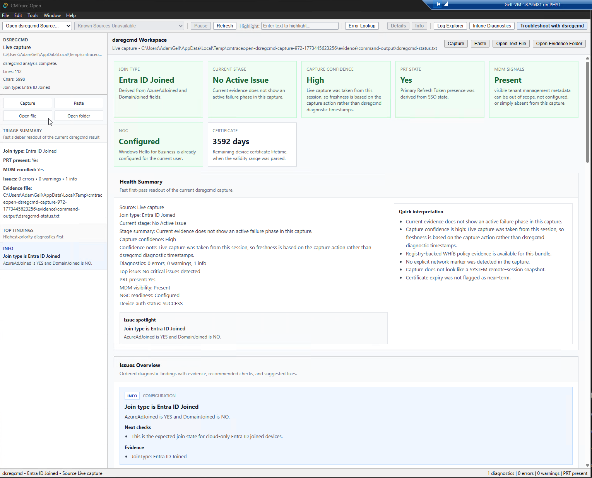

# CMTrace Open

A free, open-source log viewer and Windows troubleshooting tool. Drop in a log file and start reading — no install wizards, no prerequisites, no license keys.

Built as a modern replacement for Microsoft's CMTrace.exe with added Intune diagnostics, DSRegCmd analysis, and real-time log tailing.

## Install

Download the latest release for your platform and run it. That's it — single file, no dependencies.

| Platform | Download |
|----------|----------|
| Windows (x64) | [.msi installer](https://github.com/adamgell/CMTraceOpen/releases/latest) |
| macOS (Apple Silicon) | [.dmg](https://github.com/adamgell/CMTraceOpen/releases/latest) |
| Linux (x64) | [.deb / .AppImage](https://github.com/adamgell/CMTraceOpen/releases/latest) |

All releases are signed. The Windows executable is code-signed and the macOS app is notarized.

> **Note:** You do **not** need Node.js, Rust, or any development tools to run CMTrace Open. Just download and run.

## Features

### Log Viewer

- **Auto-detection** — automatically identifies CCM, CBS, DISM, Panther, simple, and plain text log formats
- **Real-time tailing** — live file watching with pause/resume
- **Virtual scrolling** — smooth performance with 100K+ line files
- **Severity color coding** — Errors (red), Warnings (yellow), Info (default)
- **Find and Filter** — Ctrl+F search with F3 navigation; filter by message, component, thread, or timestamp
- **Text highlighting** — configurable keyword highlighting
- **Error code lookup** — 120+ embedded Windows, SCCM, and Intune error codes
- **Flexible input** — open files, folders, drag and drop, or use built-in source presets
- **File association** — set as default `.log` file handler on Windows

### Intune Diagnostics Workspace

Analyze Intune Management Extension logs without reading raw text line by line.

- Parse a single IME log or an entire `IntuneManagementExtension\Logs` folder
- Color-coded event timeline for Win32 apps, WinGet apps, PowerShell scripts, remediations, ESP, and sync sessions
- Download statistics with size, speed, and Delivery Optimization percentage
- Summary dashboard with event counts, success/failure rates, and log time span
- Automatic GUID extraction for app and policy identifiers
- Issue clustering with suggested next steps

### DSRegCmd Troubleshooting Workspace

Triage Entra join, hybrid join, PRT, MDM, and Windows Hello for Business issues.

- Live capture, paste, text file, or evidence bundle input
- Join posture, failure stage, and capture confidence at a glance
- Issue cards with severity, evidence, and suggested fixes
- Registry-backed Windows Hello for Business policy correlation
- Export as JSON or summary for case handoff

See the [DSRegCmd troubleshooting guide](DSREGCMD_TROUBLESHOOTING.md) for a detailed walkthrough.

## Quick Start

1. **Download** the release for your platform from the [Releases page](https://github.com/adamgell/CMTraceOpen/releases/latest)
2. **Run** the executable — no install required (or use the MSI on Windows)
3. **Open a log** — drag and drop a file, use File > Open, or use a source preset
4. **Explore** — use Find (Ctrl+F), Filter, or switch to the Intune/DSRegCmd workspace

## Supported Log Formats

| Format | Examples |
|--------|----------|
| CCM | `<![LOG[...]LOG]!>` — ConfigMgr client logs |
| CBS / DISM / Panther | `CBS.log`, `dism.log`, `setupact.log`, `setuperr.log` |
| Simple | `$$<` delimited — older SCCM-style logs |
| Plain text | Any `.log` or `.txt` file with or without timestamps |

Format detection is automatic. Open any log file and CMTrace Open will pick the right parser.

## Documentation

Visit the [CMTrace Open Wiki](https://github.com/adamgell/CMTraceOpen/wiki) for detailed guides:

- [Getting Started](https://github.com/adamgell/CMTraceOpen/wiki/Getting-Started) — installation, first log, basic navigation
- [Log Viewer Guide](https://github.com/adamgell/CMTraceOpen/wiki/Log-Viewer) — find, filter, highlight, tailing
- [Intune Workspace](https://github.com/adamgell/CMTraceOpen/wiki/Intune-Workspace) — IME log analysis and diagnostics
- [DSRegCmd Workspace](https://github.com/adamgell/CMTraceOpen/wiki/DSRegCmd-Workspace) — device join and identity troubleshooting
- [FAQ](https://github.com/adamgell/CMTraceOpen/wiki/FAQ) — common questions and answers

## Contributing

CMTrace Open welcomes contributions. See [CONTRIBUTING.md](CONTRIBUTING.md) for development setup, build commands, architecture overview, and coding guidelines.

## Disclaimer

CMTrace is a tool developed and distributed by Microsoft Corporation. CMTrace Open is an independent open-source project and is **not** affiliated with, endorsed by, or connected with Microsoft Corporation. See [DISCLAIMER.md](DISCLAIMER.md) for full details.

## License

[MIT](LICENSE)
